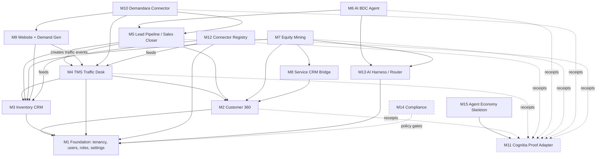

# DEALEROS FEATURE MAP AND MODULE ARCHITECTURE (V1)

STATUS: INTERNAL — DESIGN ONLY. NOT PRODUCTION READY. NO PUBLIC CLAIMS AUTHORIZED.

Owner: Muhammad Firoz · Date: 2026-07-03 · Version: V1

Purpose: the single decision-ready feature inventory for Budget Wheels DealerOS. Every feature in the 15 modules of `CONTEXT_PACK.md` Section 6 is listed with a phase tag (`[MVP]` = tenant-zero 30-day build, `[V1.1]` = next 60–90 days, `[LATER]` = post-validation) and an owner surface (**desk UI**, **API**, **job** = background job, **website**). Companion docs: platform topology in `DEALEROS_MULTI_TENANT_SAAS_ARCHITECTURE_V1.md`, sequencing in `DEALEROS_DELIVERY_MEMO_V1.md`, strategy framing in `BUDGET_WHEELS_DEALEROS_EXECUTIVE_STRATEGY_V1.md`, current-state honesty in `BUDGET_WHEELS_WHAT_WE_BUILT_SO_FAR_V1.md`, and open founder decisions in `DEALEROS_MUHAMMAD_DECISION_BOARD_V1.md`.

---

## 1. Feature map — all 15 modules

### M1 — Multi-tenant dealership foundation

| Feature | Phase | Surface |
|---|---|---|
| Tenancy chain (Tenant → DealerGroup? → Dealer → Rooftop), row-level isolation on `tenantId` | [MVP] | API |
| Users, roles (`RoleKey`), teams, salesperson assignment | [MVP] | desk UI + API |
| Per-tenant settings: branding, AI policy, approval rules, retention (`TenantSettings`) | [MVP] | desk UI + API |
| Audit log of every privileged access (incl. `platform_admin`, always receipted) | [MVP] | API + job |
| Manager permission gates (e.g. `internalCost` visibility) | [MVP] | desk UI + API |
| Per-tenant connector/website/proof-ledger bindings | [V1.1] | desk UI + API |
| Dealer-group roll-up views and cross-rooftop reporting | [LATER] | desk UI |
| Self-serve tenant onboarding | [LATER] | desk UI + API |

### M2 — Customer 360

| Feature | Phase | Surface |
|---|---|---|
| Customer profile, contact methods, preferred language, tags, segment | [MVP] | desk UI + API |
| CASL-aware consent records (`ConsentRecord`: express vs implied, expiry) with `consent_captured` receipts | [MVP] | desk UI + API |
| Notes and tasks on customer (`WorkTask`) | [MVP] | desk UI |
| Duplicate detection (`duplicateClusterKey`) with human merge review | [MVP] | job + desk UI |
| Owned/leased vehicle history (`OwnedVehicle`) — equity-mining substrate | [V1.1] | desk UI + API |
| Household grouping (`HouseholdId`) | [V1.1] | job + desk UI |
| Privacy controls: delete/export request workflow, anonymization | [V1.1] | desk UI + API + job |
| Communication/service/ownership timeline unified view | [V1.1] | desk UI |

### M3 — Inventory CRM

| Feature | Phase | Surface |
|---|---|---|
| Vehicle record: VIN, stock #, YMMT, mileage, all-in `askingPrice`, photos, features | [MVP] | desk UI + API |
| Status lifecycle (`VehicleStatus`: incoming → in_recon → available → pending → sold / wholesale / archived) | [MVP] | desk UI + API |
| Structured disclosures (`VehicleDisclosure`, BC Motor Dealer Act-style) | [MVP] | desk UI |
| Days-in-inventory + listing completeness score (deterministic checklist) | [MVP] | job + desk UI |
| Permission-gated `internalCost` | [MVP] | desk UI + API |
| Carfax/inspection/market-price external refs (mock connectors only) | [V1.1] | API + job |
| Merchandising score + AI listing assistant (drafts human-approved before publish) | [V1.1] | desk UI + job |
| SEO-ready VDP content generation (`MerchandisingState.seoContent`) | [V1.1] | job + website |
| Market price data feeds (live) | [LATER] | job |

### M4 — TMS traffic desk

| Feature | Phase | Surface |
|---|---|---|
| Traffic event capture for all `TrafficSourceKind` values (phone/internet/walk-in/website/marketplace/after-hours/service-drive/referral/partner) | [MVP] | desk UI + API |
| Appointment board (day/week view, per rooftop) | [MVP] | desk UI |
| SLA timers per source (`SlaState`; e.g. internet 15 min, after-hours 9:05 next morning) with breach escalation | [MVP] | job + desk UI |
| Assignment (round-robin + manual override) | [MVP] | desk UI + job |
| No-show tracking and outcome recording (`TrafficOutcome`, `LostReason`) | [MVP] | desk UI |
| Source/campaign/UTM tracking on every event | [MVP] | API + website |
| Manager accountability dashboard (response times, per-salesperson follow-up) | [MVP] | desk UI |
| Traffic-to-sale reporting (event → deal conversion by source) | [V1.1] | desk UI + job |
| SLA defaults calibrated to real Budget Wheels lead volume | [V1.1] | job — SKIPPED_WITH_REASON: calibration requires real customer/lead data; V1 ships opinionated defaults only. |

### M5 — Lead pipeline / Sales Closer

| Feature | Phase | Surface |
|---|---|---|
| Stage pipeline (`LeadStage`: new → working → qualified → appointment_set → shown → negotiating → deal_draft → sold/lost/dormant) | [MVP] | desk UI + API |
| Qualification capture (`LeadQualification`: intent, budget, desired vehicle, trade-in, financing, timeline) | [MVP] | desk UI |
| Appointment/test-drive drafts (`Appointment`, `draftedBy: 'agent'` requires human confirm) | [MVP] | desk UI + API |
| Deal draft with sold/lost reason (`Deal`, `LostReason`) | [MVP] | desk UI |
| Proof receipts on every stage transition | [MVP] | job |
| Objection tracking with codes | [V1.1] | desk UI |
| Follow-up plan cadence (`FollowUpPlan`) with opt-out pause | [V1.1] | job + desk UI |
| AI-assisted booked-appointment attribution (`aiAssistedAppointment`) | [V1.1] | job |

### M6 — AI BDC agent

| Feature | Phase | Surface |
|---|---|---|
| Instant lead-response draft (never auto-sent; `requiresHumanApproval: true`) | [MVP] | job + desk UI |
| Escalation to human + approval queue | [MVP] | desk UI |
| Proof receipt per draft (`ai_reply_drafted`, `human_approval_granted`) | [MVP] | job |
| Availability answers + similar-vehicle recommendation from live inventory context | [V1.1] | job + API |
| Price/payment explanation with disclaimers; financing routing; trade-in intake | [V1.1] | job + desk UI |
| Follow-up drafts, lost-lead resurrection, service-to-sales drafts | [V1.1] | job |
| Call/chat/SMS summarization | [V1.1] | job |
| Live SMS/voice channels | [LATER] | API — SKIPPED_WITH_REASON: requires telephony vendor contract (Twilio/voice provider) and live-mode approval; mock adapter only in V1. |

### M7 — Equity mining / opportunity engine

| Feature | Phase | Surface |
|---|---|---|
| Deterministic scoring (`OpportunityScore`: 0–100, hot/warm/watch bands, weighted `factors`) | [V1.1] | job |
| Reason codes (`OpportunityReasonCode`: lease maturity, finance term, equity estimate, mileage, warranty end, service recency, orphan owner, household, website intent, trade-in window) | [V1.1] | job |
| Inventory match (`matchedInventoryVehicleIds`) + claim-safe recommended pitch | [V1.1] | job + desk UI |
| Next best action (`NextBestAction`: call task / SMS draft / email draft, always approval-gated) | [V1.1] | desk UI + job |
| Result tracking (contacted/appointment/sold/dismissed) | [V1.1] | desk UI |
| Segments: service-only, sold, orphan, household | [V1.1] | job |
| Payment-to-upgrade math with lender data | [LATER] | job — NEEDS_EXTERNAL_RESEARCH: lender/payoff data access terms; see `research/autoalert.md` for the feature pattern, not for data access. |

### M8 — Service CRM / fixed-ops bridge

| Feature | Phase | Surface |
|---|---|---|
| Service appointment history on Customer 360 | [V1.1] | desk UI + API |
| Service-drive traffic events feeding equity alerts | [V1.1] | desk UI + job |
| Service-to-sales lead creation with receipts | [V1.1] | desk UI + job |
| Declined service, recalls, maintenance reminders, tire/storage | [LATER] | job + desk UI |
| BDC service campaigns, advisor tasks, retention scoring | [LATER] | job + desk UI |

### M9 — Website + Demand Gen engine

| Feature | Phase | Surface |
|---|---|---|
| Homepage, inventory list pages, VDPs with schema.org (Vehicle/AutoDealer/LocalBusiness/FAQPage/BreadcrumbList/Organization) | [V1.1] | website |
| Appointment/test-drive lead forms (CASL-aware consent capture) → traffic events | [V1.1] | website + API |
| UTM capture + source/campaign attribution into `TrafficEvent.utm` | [V1.1] | website + API |
| Local SEO pages, city/service-area pages, category pages (SUV/truck/sedan/van/EV-hybrid) | [V1.1] | website + job |
| Finance and trade-in pages; FAQ; buying guides | [V1.1] | website |
| AEO answer blocks + AIO-friendly sections | [V1.1] | website + job |
| Bad/no-credit pages | [LATER] | website — SKIPPED_WITH_REASON: credit-related advertising copy requires legal counsel review (BC VSA / advertising rules) before design is finalized. |
| CRM outcome feedback loop to Demandara | [V1.1] | API + job |

### M10 — Demandara connector/harness

| Feature | Phase | Surface |
|---|---|---|
| Lead push `POST /api/demandara/leads` → traffic event + lead | [V1.1] | API |
| Redacted context pack `GET /api/demandara/context/:leadId` | [V1.1] | API |
| Draft endpoints: `/reply-drafts`, `/appointment-drafts`, `/followups` (all approval-gated) | [V1.1] | API |
| Campaign registration `POST /api/demandara/campaigns` | [V1.1] | API |
| Outcomes + attribution: `GET /outcomes`, `GET /revenue-attribution` | [V1.1] | API + job |
| Monthly proof-backed marketing report `GET /proof-report` | [V1.1] | API + job |
| Live Demandara↔DealerOS bidirectional sync in production | [LATER] | API — SKIPPED_WITH_REASON: requires the dedicated DealerOS repo and a deployed Demandara instance; V1 ships contracts + in-memory adapter only. |

### M11 — Cognitia proof adapter

| Feature | Phase | Surface |
|---|---|---|
| Receipt emission for all 22 event types in `CONTEXT_PACK.md` §6.11 (lead_received … connector_sync_failed) | [MVP] | job |
| Full receipt fields incl. `actor_type`, `policy_gate_result`, `consent_basis`, `payload_hash`, `claim_safe_summary`, `rollback_path`, `dispute_path` | [MVP] | job |
| Hash-chained per-tenant ledger (in-memory reference; durable store in dedicated repo) | [MVP] | job |
| Receipt viewer with redacted customer refs | [MVP] | desk UI |
| Auditor role read access | [V1.1] | desk UI |
| Cross-system receipt export to standalone Cognitia service | [LATER] | API |

### M12 — Connector registry

| Feature | Phase | Surface |
|---|---|---|
| Registry with mock/sandbox/live modes; mock default; live gated on human-approval receipt | [MVP] | API + desk UI |
| Env-var-**names**-only secret config; secret-looking strings rejected at registration | [MVP] | API |
| Mock adapters: DealerMine, TMS, CSV inventory feed, SMS, calendar | [MVP] | job |
| Health checks that never call live APIs unless explicitly enabled | [MVP] | job |
| Inventory feed ingestion (CSV/XML/JSON, AutoTrader-like, website feed) | [V1.1] | job |
| Gmail/Outlook, Google/Microsoft Calendar connectors (sandbox) | [V1.1] | job + API |
| DMS connectors (CDK, Reynolds, Dealertrack, Quorum, DealerCenter, AutoSync), marketplace listing assistants, Google Business Profile, Stripe, QuickBooks | [LATER] | job — SKIPPED_WITH_REASON: each requires a vendor contract/partner API agreement; no live credentials exist and none may be created without human approval. NEEDS_EXTERNAL_RESEARCH: current partner-API availability per vendor; see `research/dealermine.md`, `research/tms-canada.md`, `research/cdk.md`, `research/marketplaces.md` — do not assert vendor capabilities beyond those files. |

### M13 — AI harness / model router

| Feature | Phase | Surface |
|---|---|---|
| Provider interface + task-based router with fallback (OpenAI/Anthropic/OpenRouter/Ollama-local; mock provider default) | [MVP] | job |
| PII redaction gate before every external model call (`piiToExternalModelsAllowed: false` hard-off in V1) | [MVP] | job |
| Tool-call approval gates + model usage ledger | [MVP] | job + desk UI |
| Prompt/version registry (`modelVersion` on scored outputs) | [MVP] | job |
| Cost controls per tenant; local-only mode | [V1.1] | job + desk UI |
| Eval harness for AI tasks (lead classification, intent, vehicle match, reply drafting, etc.) | [V1.1] | job |
| Live provider keys and routing in production | [LATER] | job — SKIPPED_WITH_REASON: requires live API keys; forbidden in this workspace. Mock provider + env-var names only. |

### M14 — Compliance / enterprise readiness

| Feature | Phase | Surface |
|---|---|---|
| RBAC, tenant isolation, audit logs, activity logs | [MVP] | API + job |
| CASL/PIPEDA/PIPA(BC) consent tracking + opt-out handling | [MVP] | API + desk UI |
| AI disclosure footer on AI-assisted outbound drafts | [MVP] | job |
| Data minimization + retention settings | [V1.1] | job |
| Right to delete/export workflows; GDPR-ready data-rights patterns | [V1.1] | desk UI + job |
| Webhook verification, rate limiting, connector permission scopes | [V1.1] | API |
| SOC 2 *readiness* program (controls mapping; explicitly not certification) | [LATER] | job |
| TCPA/CAN-SPAM handling for US tenants | [LATER] | job — SKIPPED_WITH_REASON: US expansion requires legal counsel; Canada-first per `research/canada-compliance.md`. |

### M15 — Agent economy skeleton (internal only; no token, no crypto, no public marketplace)

| Feature | Phase | Surface |
|---|---|---|
| Type primitives: agent_passports, agent_actions, proof_receipts linkage, work_credit_candidates, reputation_events, dispute_events, human_review_events | [MVP] | API (types only) |
| Work-event definitions (13 events, lead_answered … connector_sync_completed) with evidence + approval requirements | [MVP] | job (definitions only) |
| Work-credit candidate accrual from receipts | [LATER] | job |
| Reputation scoring + dispute workflow | [LATER] | desk UI + job |

---

## 2. Module dependency diagram

Build order follows the arrows bottom-up: M1 → (M2, M3, M11, M13, M12 mocks) → M4 → M5 → M6, then V1.1 layers (M7, M8, M9, M10), with M14 controls landing alongside each phase and M15 as types only until validation.

## 3. Core data-flow narrative

1. **Traffic event.** An inbound contact (call answered at the desk, website form via M9, marketplace message, walk-in) is logged as a `TrafficEvent` with `source`, `sourceDetail`, optional `campaignId`/`utm`, and an `SlaState` computed per source. Receipt: `lead_received`. If a form captured consent, a `ConsentRecord` is written and `consent_captured` is emitted.
2. **Lead.** Identification/dedup links or creates a `Customer` (`customer_created`, `duplicate_detected` receipts). A `Lead` opens with `sourceTrafficEventId`, is assigned (round-robin or manual), and qualification (`LeadQualification`) fills in. M6 may draft an instant reply through M13 (redaction gate first) — `ai_reply_drafted` → `human_approval_requested` → `human_approval_granted`; only then does anything leave the building.
3. **Appointment.** A human or agent drafts an `Appointment` (`appointment_drafted`); AI drafts (`draftedBy: 'agent'`) require human confirmation before any outbound confirmation (`appointment_confirmed`, later `test_drive_completed`). No-shows update the traffic outcome and feed the accountability dashboard.
4. **Deal.** A `Deal` draft attaches lead + customer + vehicle; the vehicle moves `available → pending → sold`; `sold_marked` (or `lost_reason_recorded`) closes the loop on both the lead and the originating traffic event.
5. **Receipt.** Every step above emitted a hash-chained proof receipt (M11) carrying `actor_type`, `policy_gate_result`, `consent_basis`, `payload_hash`, and a `claim_safe_summary` — the "paper trail" half of the product metaphor.
6. **Attribution.** `DealAttribution` records first/last touch (`TrafficSourceKind` + `campaignId`), `aiAssisted`, and `touchCount`. Aggregations flow to the traffic-to-sale report (M4), the Demandara endpoints `GET /outcomes`, `GET /revenue-attribution`, `GET /proof-report` (M10), and — because each hop is receipted — every attribution claim in a report can cite its receipts.

## 4. Entity map summary of `build-packets/schemas/core.ts`

Actual exported types, grouped:

| Group | Exported types |
|---|---|
| Scalars/IDs | `IsoTimestamp`, `Money`, `Brand`, and branded IDs: `TenantId`, `DealerGroupId`, `DealerId`, `RooftopId`, `UserId`, `TeamId`, `CustomerId`, `HouseholdId`, `VehicleId`, `LeadId`, `TrafficEventId`, `AppointmentId`, `DealId`, `CampaignId`, `OpportunityId`, `ConnectorId`, `ReceiptId`, `AgentPassportId`, `AgentActionId`, `TaskId`, `WebsiteId` |
| M1 Foundation | `Tenant`, `TenantSettings`, `ExternalSideEffectKind`, `DealerGroup`, `Dealer`, `Rooftop`, `PostalAddress`, `RoleKey`, `User`, `Team` |
| M2 Customer 360 | `ConsentChannel`, `ConsentRecord`, `ContactMethod`, `Customer`, `OwnedVehicle` |
| M3 Inventory | `VehicleStatus`, `Vehicle`, `VehicleDisclosure`, `MerchandisingState` |
| M4 Traffic desk | `TrafficSourceKind`, `TrafficEvent`, `SlaState`, `TrafficOutcome`, `LostReason` |
| M5 Pipeline | `LeadStage`, `Lead`, `LeadQualification`, `FollowUpPlan`, `Appointment`, `Deal`, `DealAttribution` |
| M9/M10 Campaigns | `Campaign` |
| M7 Opportunity | `OpportunityReasonCode`, `OpportunityScore`, `NextBestAction` |
| Shared | `WorkTask` |

Design invariants encoded in the types: money is integer cents (`Money`); all timestamps ISO-8601 UTC; every tenant-owned record carries `tenantId`; PII fields are comment-marked for the redaction gate; `NextBestAction.requiresHumanApproval` is literally typed `true`; `TenantSettings.aiPolicy.piiToExternalModelsAllowed` is literally typed `false`.

## 5. Scaffolded in build-packets vs pure design

| Area | Status | Where |
|---|---|---|
| Core domain types (M1–M5, M7, M9 shapes) | **Scaffolded** (typechecked) | `schemas/core.ts` |
| Proof receipts, hash-chained emitter, claim-safe summaries, agent-economy types (M11, M15) | **Scaffolded** (tested) | `cognitia/receipts.ts`, `cognitia/agent-economy.ts` |
| Connector registry + mock DealerMine/TMS/CSV/SMS/calendar adapters (M12) | **Scaffolded** (tested) | `connectors/registry.ts`, `connectors/mocks.ts` |
| AI provider interface, router, redaction gate, usage ledger, prompt registry (M13) | **Scaffolded** (tested) | `ai-harness/provider.ts`, `ai-harness/redaction.ts`, `ai-harness/usage-ledger.ts` |
| Demandara 9-endpoint contracts + in-memory adapter (M10) | **Scaffolded** (tested) | `demandara/api-contracts.ts`, `demandara/service.ts` |
| Equity-mining deterministic mock scoring (M7) | **Scaffolded** (tested) | `equity-mining/scoring.ts`, `equity-mining/fixtures.ts` |
| Traffic-desk SLA math, assignment, state machines (M4) | **Scaffolded** (tested) | `traffic-desk/sla.ts`, `traffic-desk/assignment.ts`, `traffic-desk/state-machine.ts` |
| Website claim-safety linter, SEO/JSON-LD builders, CASL forms, UTM capture, AEO blocks (M9) | **Scaffolded** (tested) | `website/claims.ts`, `website/seo.ts`, `website/structured-data.ts`, `website/forms.ts`, `website/utm.ts`, `website/local-pages.ts` |
| Desk UI (all modules), persistence layer, auth, deploy pipeline | **Pure design** | SKIPPED_WITH_REASON: requires the dedicated code repo (`cognitiacloud/dealeros`, Week-1 item per `DEALEROS_DELIVERY_MEMO_V1.md`); this Library repo is not the production codebase. |
| Database DDL/migrations | **Pure design** | SKIPPED_WITH_REASON: production migrations are prohibited here; schema derives from `core.ts` in the dedicated repo. |
| M6 BDC conversation flows, M8 service bridge, M14 control mapping | **Pure design** | This doc + `DEALEROS_MULTI_TENANT_SAAS_ARCHITECTURE_V1.md` |

All scaffolds are dependency-free reference code with mock data only — they pin vocabulary and governance rules (see build-packets `README.md` "Rules encoded here"), they are not the application.

## 6. MVP cutline rationale — what Budget Wheels needs in 30 days

Tenant-zero is one independent used-car dealer in Vancouver with one rooftop, a small sales team, and no working CRM discipline today. The 30-day question is not "full platform" but: **can the desk log every piece of traffic, answer every internet lead fast with an approved AI draft, book appointments, record outcomes, and prove all of it with receipts?**

1. **In (MVP):** M1 foundation (single-tenant path of the multi-tenant schema — build multi-tenant shapes, exercise one tenant), M2 customer basics + consent, M3 inventory basics with disclosures, M4 traffic desk complete core (this is the daily-use wedge and the habit-forming surface), M5 pipeline through deal draft, M6 draft-only instant response, M11 receipts everywhere, M12 registry + mocks, M13 harness with mock provider, M14 baseline controls (RBAC, audit, consent, AI disclosure). Rationale: this is the minimum loop that produces the internal proof report Budget Wheels' demo narrative depends on (`BUDGET_WHEELS_WHAT_WE_BUILT_SO_FAR_V1.md`), and every piece is already vocabulary-pinned in build-packets.
2. **Out until V1.1:** M7 equity mining (needs `OwnedVehicle` history that tenant-zero must first accumulate), M8 service bridge (Budget Wheels' fixed-ops volume is small; the sales desk pays the bills first), M9 website engine (a basic site + forms can wait 30 days; UTM capture design is ready when it lands), M10 live Demandara wiring (contracts exist; Demandara itself sequences separately).
3. **Out until LATER:** all live vendor connectors (contracts + approvals required), agent-economy activation (needs receipt volume to be meaningful), SOC 2 readiness program and US compliance (no US tenants), payment/accounting connectors.
4. **Acceptance criteria for the MVP cut (all internal, mock/local, no public claims):**
   - Every inbound traffic type can be logged in ≤ 30 seconds from the desk UI, and 100% of logged events carry a receipt.
   - Internet-lead SLA timer fires and escalates on breach in a deterministic test with injected clocks.
   - An AI reply draft can be generated (mock provider), approved by a named human, and marked sent-in-mock — with the full receipt chain (`ai_reply_drafted` → `human_approval_requested` → `human_approval_granted`) inspectable in the receipt viewer.
   - A lead can be walked new → appointment_set → shown → deal_draft → sold, and the traffic-to-sale linkage plus `DealAttribution` render in a report.
   - Zero external network calls in the default configuration; connector health checks pass in mock mode.

---

## Boundaries honored

- No secrets, no real API keys anywhere; connector config carries env-var **names** only.
- No live CRM writes, no live DMS writes, no live DealerMine/TMS/marketplace integration — mock mode is the default for every connector and model provider; live mode is design-gated behind human approval + proof receipt and is not enabled in this phase.
- No dealership or customer outreach; no real customer PII — all data referenced is fake/reserved/local-only.
- No production deploy, no production migrations; this Library repo is not the production codebase, and the dedicated repo does not exist yet.
- No fake customer proof, no public launch claims, no "production ready" language — this document is internal design only.
- No crypto/token implementation; M15 is internal primitives only, with no marketplace and no securities language.
- No compliance certification claims: M14 targets SOC 2 *readiness* patterns only; CASL/PIPEDA/PIPA handling is design-stage and unreviewed by counsel.
- Blocked or unverifiable items are marked `SKIPPED_WITH_REASON:` / `NEEDS_EXTERNAL_RESEARCH:` inline above rather than guessed at.
